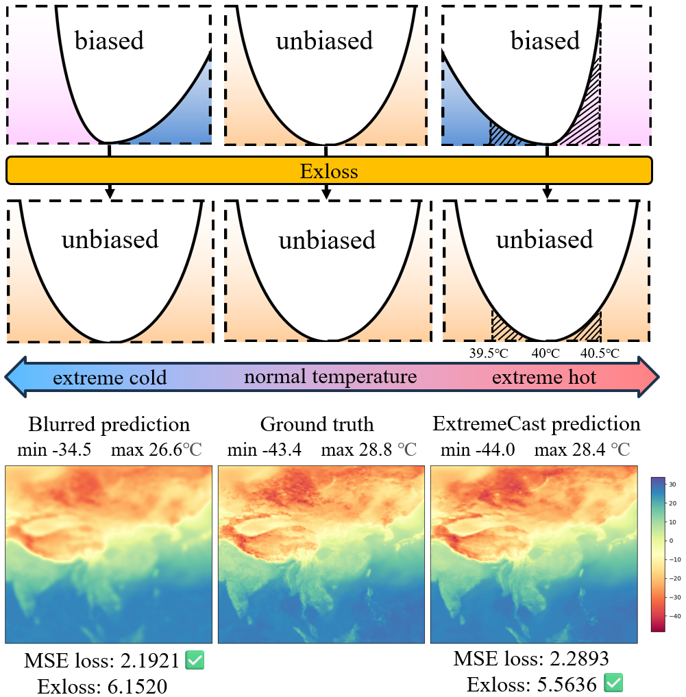
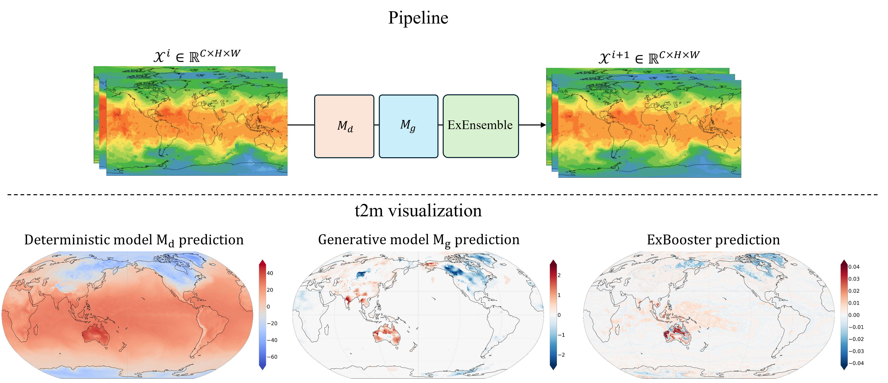

# ExtremeCast: Boosting Extreme Value Prediction for Global Weather Forecast [[Paper](https://arxiv.org/abs/2402.01295)]

## Abstract

Data-driven weather forecast based on machine learning (ML) has experienced rapid development and demonstrated superior performance in the global medium-range forecast compared to traditional physics-based dynamical models. However, most of these ML models struggle with accurately predicting extreme weather, which is related to training loss and the uncertainty of weather systems. Through mathematical analysis, we prove that the use of symmetric losses, such as the Mean Squared Error (MSE), leads to biased predictions and underestimation of extreme values. To address this issue, we introduce Exloss, a novel loss function that performs asymmetric optimization and highlights extreme values to obtain accurate extreme weather forecast. Beyond the evolution in training loss, we introduce a training-free extreme value enhancement module named ExBooster, which captures the uncertainty in prediction outcomes by employing multiple random samples, thereby increasing the hit rate of low-probability extreme events. Combined with an advanced global weather forecast model, extensive experiments show that our solution can achieve state-of-the-art performance in extreme weather prediction, while maintaining the overall forecast accuracy comparable to the top medium-range forecast models. 




## Usage
### 1. Download Data and Checkpoints
Download required data and checkpoints from [GoogleDrive](https://drive.google.com/drive/folders/1UyLCFGxZnBx-sCIVr8snxkWNUJAqnyKu). (When applying for permission, could you please briefly explain your occupation such as student, corporate employee, research institution staff, etc., and the purpose of using the model? Thank you for your cooperation!)

Store files according to the following structure:

<pre>
.
├── checkpoints
│   ├── model_d.onnx
│   └── model_g.pth
├── data
│   ├── 2017-12-31T18:00:00.npy
│   ├── 2018-01-01T00:00:00.npy
│   ├── 2018-01-01T06:00:00.npy
│   ├── climatology-2018-01-01T06:00:00.npy
│   ├── data_mean.npy
│   ├── data_std.npy
│   ├── diffusion_max.npy
│   ├── diffusion_min.npy
│   ├── max_logvar.npy
│   └── min_logvar.npy
├── ExBooster.py
├── Exloss.py
├── images
│   ├── exloss.png
│   └── t2m_visualization.png
├── model
│   ├── attend.py
│   └── denoising_diffusion_pytorch.py
├── pic.py
├── README.md
├── RQE_SEDI_metrics.py
├── run.py
└── utils.py
</pre>

### 2. Inference
Run run.py on GPU device.

For the input and output of the model, their dimensions are [B, C, H, W], where C=69, each channel corresponds to a weather variable, and their correspondence is shown in the [variable-order](https://docs.google.com/spreadsheets/d/1KNY0P4_zkH9r1RIEu_VhvZic65Apz9BX/edit?usp=sharing&ouid=117415241894938396384&rtpof=true&sd=true).

### 3. Result
If it runs correctly, you will see the following picture in the current directory.



## Citation
```bibtex
@article{xu2024extremecast,
  title={Extremecast: Boosting extreme value prediction for global weather forecast},
  author={Xu, Wanghan and Chen, Kang and Han, Tao and Chen, Hao and Ouyang, Wanli and Bai, Lei},
  journal={arXiv preprint arXiv:2402.01295},
  year={2024}
}
```
